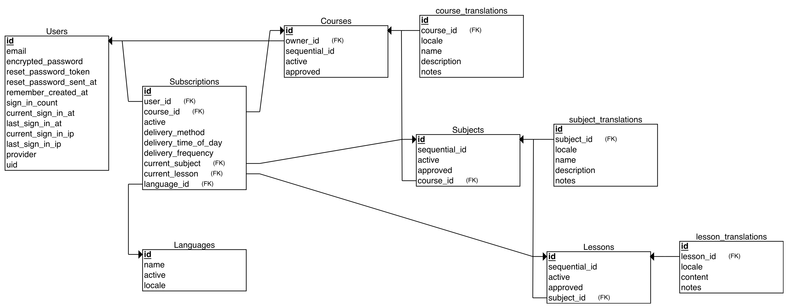

# Soul Medicine

## Currently in development

## Development

* Ruby version - `2.5.2`
* Rails version - `5.2`
* System dependencies
  * PostgreSQL
  * Rails 5.2
* Configuration
  * Run `cp .env.sample .env.development` to create the local env file
  * Populate the environment variables
  * Run `rails secret` to generate an APP_SECRET
* Database creation
  * Ensure that PG is running `pg_ctl start`
  * Run `rails db:setup`
<!-- TODO: Add more details
* How to run the test suite

* Services (job queues, cache servers, search engines, etc.)

* Deployment instructions

* ... -->

